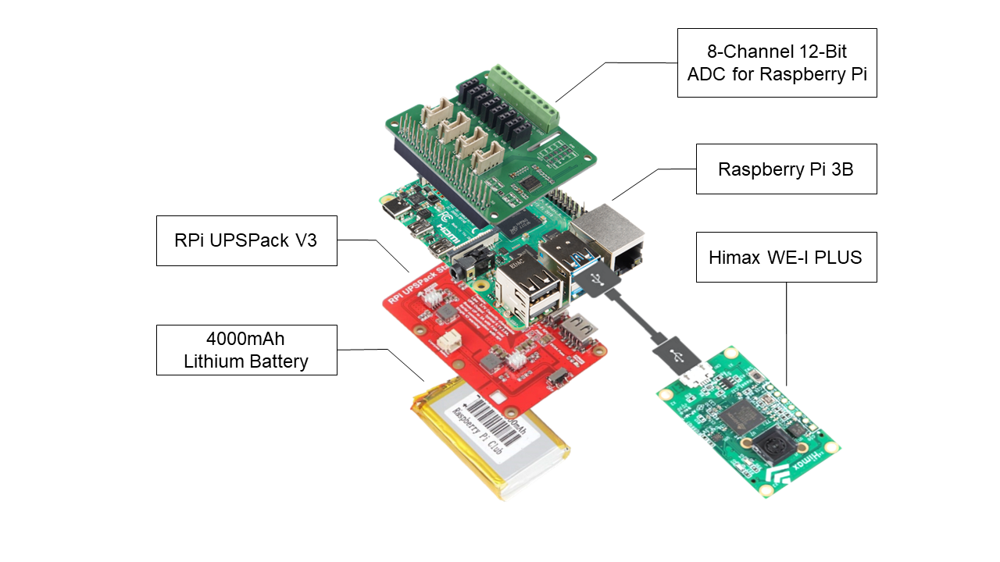

# AIoT PD Foot Pressure Sensing Insole
This application is designed to show how to diagnose whether the users have the tendancy of Parkinson's disease using embARC. **AIoT PD Foot Pressure Sensing Insole** can measure user's gait, and then judge if the user is in high risk of the disease by NN Model. Every components of the device are detachable which makes it superior in mobility and convenience. Also, it can be controlled by Android App. The connection between the device and the Smartphone is based on Wi-Fi.

* [Introduction](#introduction)
	* [System Architecture](#system-architecture)
	* [Android App](#android-app)
* [Hardware and Software Setup](#hardware-and-software-setup)
	* [Required Hardware](#required-hardware)
	* [Required Software](#required-software)
	* [Hardware Connection](#hardware-connection)
* [User Manual](#user-manual)
	* [Before Running This Application](#before-running-this-application)
	* [Run This Application](#run-this-application)

## Introduction

**AIoT PD Foot Pressure Sensing Insole**

AIoT PD Foot Pressure Sensing Insole is a smart device which can be used to monitor the high-risk populations of Parkinson's disease. By daily monitoring, users can get the warning before everything get worse and look for the treatment as soon as possible. For PD patients, our project can also be a severity reference.

### System Architecture

### Android App
Our device can be controlled by AIoT-PD Android App. You can start/stop the measurement, see your foot pressure destribution and the final result on the App.

## Hardware and Software Setup
### Required Hardware
- 1 [Himax WE-I Plus EVB Endpoint AI Development Board][2]

- 2 Raspberry Pi 3 B
- 2 [8-Channel 12-Bit ADC for Raspberry Pi (STM32F030)][3]
- 2 [RPi UPSPack V3][4]
- 2 4000mAh Lithium Battery
- 2 Pressure Sensing Insoles(Homemade)

- **The Pressure Sensing Insole shown below.**

	

	- 2 Insoles
	- 16 [FlexiForce A301 Pressure Sensor (111N)][1]

- **The physical picture shown below.**

- **The structure diagram shown below.**

### Required Software
- Metaware or ARC GNU Toolset
- embARC Machine Learning Inference Library
- AIoT-PD Android App

### Hardware Connection
- Connect **Himax WE-I Plus** to **Raspberry Pi** with USB cable(using UART)
- Connect **Raspberry Pi** to **8-Channel 12-Bit ADC** and **RPi UPSPack V3**(with Lithium Battery)
- Connect **pressure sensing insole** to **8-Channel 12-Bit ADC**
- Connect **Raspberry Pi** and mobile phone via WiFi

## User Manual
### Before Running This Application
- Download source code and AIoT-PD App from github
- Setup hardware connection (The hardware resources are allocated as following table.)

|  Hardware Resource  |            Function                                           |
| ------------------- | ------------------------------------------------------------- |
|  FlexiForce A301    |        Pressure  sensor                                       |
|  STM32F030          |        ADC for Raspberry Pi                                   |
|  RPi UPSPack V3     |        Portable Power Supply                                  |
|  Raspberry Pi 3     |        Data Preprocessing, Provide Wifi Connection            |
### Run This Application
##### To start foot pressure collecting and make disease diagnoses
- Create output_gnu.img
		-aaaa

		Open folder in Visual Studio Code (……/arc_contest/Synopsys_SDK/User_Project/foot_project_split_test)
		Open Terminal and key-in "make"
		
		Open Virtual Machine Ubuntu and go to same project path ({Share Folder…}\arc_contest\Synopsys_SDK\User_Project\foot_project_split_test)
		Open Terminal and key-in "make flash"
		Get output_gnu.img
- Press reset on WE-I Plus board 
- Modify IP on Raspberry Pi 3 and APP to your own
- Connect your Raspberry Pi 3 and Mobilephone to same Wi-Fi
##### To sign up a new ID in AIoT-PD APP
- Open AIoT-PD APP
- Type your `Name` and `Password`
- Click `register button` to register

##### To run AIoT-PD APP
- Open AIoT-PD APP and sign in
- Press `Start Boutton` to start data collecting
- Press `Stop Boutton` to stop data collecting	
- After walking for 30 seconds, press `Show Result Boutton` to see the score
	

[1]: http://www.memstec.com.tw/productDetail.php?PNo=107	"FlexiForce A301 Pressure Sensor (111N)"
[2]: https://www.sparkfun.com/products/17256	"Himax WE-I Plus EVB Endpoint AI Development Board"
[3]: https://wiki.seeedstudio.com/8-Channel_12-Bit_ADC_for_Raspberry_Pi-STM32F030/	"8-Channel 12-Bit ADC for Raspberry Pi (STM32F030)"
[4]: https://www.raspberrypi.com.tw/10684/55/	"RPi UPSPack V3"
